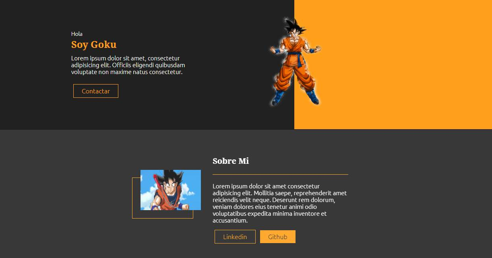
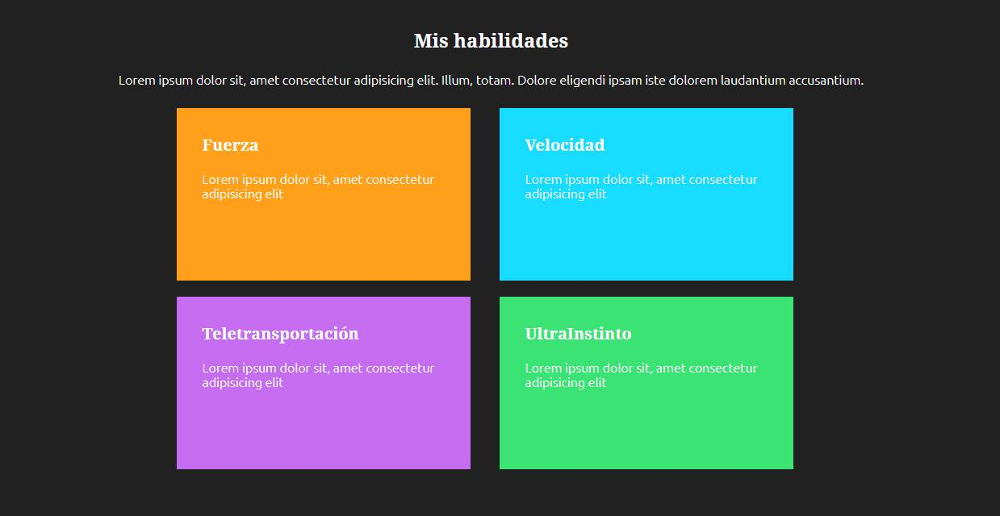

# WEB PERSONAL GOKU :fire:

Code to create personal website with GOKU theme, using Vue3, VueCli and Sass.

## Screenshot

*  Data and About



*  Skills



## Project setup
```
npm install
```


### Compiles and hot-reloads for development
```
npm run serve
```

### Compiles and minifies for production
```
npm run build
```

### Lints and fixes files
```
npm run lint
```

### Customize configuration
See [Configuration Reference](https://cli.vuejs.org/config/).
